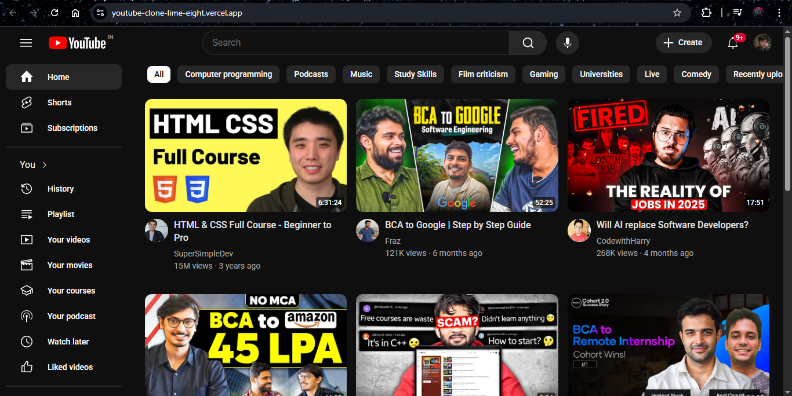

# 🎬 YouTube Clone (HTML + CSS)

This is a **frontend-only clone of the YouTube homepage UI**, created using **HTML** and **CSS**. The goal of this project was to practice layout design, spacing, styling, and responsive structure (to some extent) after learning the basics of web development.

> ✅ This is my first major web development project!

---

## 📸 Preview

Live Site: [youtube-clone-lime-eight.vercel.app](https://youtube-clone-lime-eight.vercel.app/)  
 
---

## 🛠️ Tech Stack

- **HTML5**
- **CSS3**

---

